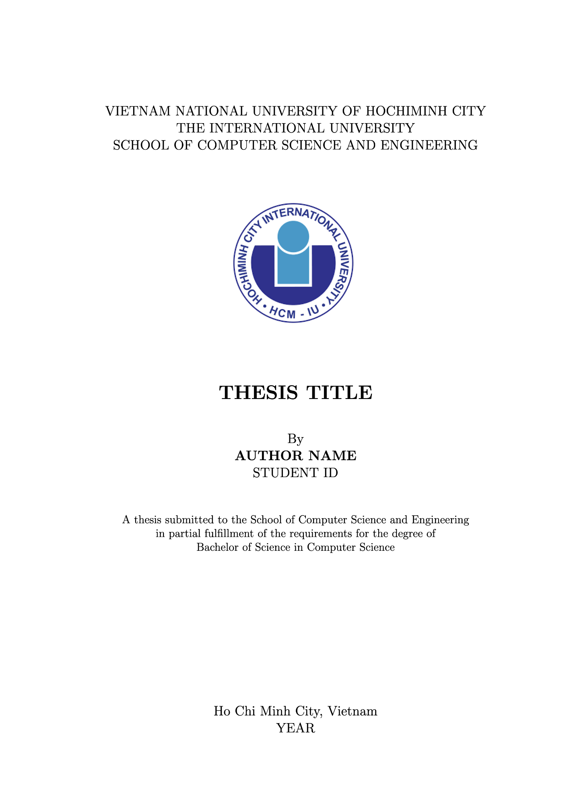

# Thesis LaTeX Template

A LaTeX template thesis template for IUer at International University, Vietnam National University of Hochiminh City.
Initially content is for Bachelor of Science theses at the School of Computer Science and Engineering, but can be adapted for other fields.



## Directory Structure

```
thesis_latex_template/
├── main.tex                    # Main document file
├── reference.bib               # Bibliography file
├── README.md                   # This file
├── before_main/                # Front matter files
│   ├── title.tex               # Title page
│   ├── approval.tex            # Thesis approval page
│   ├── acknowledge.tex         # Acknowledgments
│   └── abstract.tex            # Abstract
├── tex/                        # Chapter files
│   ├── intro.tex               # Chapter 1: Introduction
│   ├── related.tex             # Chapter 2: Background and Related Work
│   ├── method.tex              # Chapter 3: Methodology
│   ├── implementation.tex      # Chapter 4: Implementation
│   ├── result.tex              # Chapter 5: Results
│   ├── discussion.tex          # Chapter 6: Discussion
│   ├── conclusion.tex          # Chapter 7: Conclusion
│   └── appendix/               # Appendices
│       └── appendix1.tex       # Appendix A
├── images/                     # Place your images here (logos, photos)
└── figures/                    # Place your figures here (diagrams, charts)
```

## Quick Start

1. **Copy the template** to your working directory
2. **Replace placeholders** in `before_main/` files with your information
3. **Write your content** in the chapter files
4. **Add references** to `reference.bib`
5. **Compile** with `pdflatex main.tex`

## Usage Instructions

### 1. Update Front Matter

Edit files in `before_main/`:

| File              | What to Update                            |
| ----------------- | ----------------------------------------- |
| `title.tex`       | Thesis title, your name, student ID, year |
| `approval.tex`    | Supervisor and committee member names     |
| `acknowledge.tex` | Your acknowledgments                      |
| `abstract.tex`    | Abstract (150-300 words) and keywords     |

### 2. Write Your Chapters

Edit files in `tex/` directory. Each file contains:

- Section structure
- Examples of tables, figures, algorithms, and code listings
- Comments showing where to add content

### 3. Add Bibliography

Add references to `reference.bib` in BibTeX format. See the mock examples for reference types:

- `@article` - Journal papers
- `@inproceedings` - Conference papers
- `@book` - Books
- `@techreport` - Technical reports
- `@misc` - Websites
- `@mastersthesis` - Theses

### 4. Compile

```bash
pdflatex main.tex
bibtex main
pdflatex main.tex
pdflatex main.tex
```

Or use an IDE: TeXstudio, Overleaf, or VS Code with LaTeX Workshop.
For macOS, I recommend Texifier.

---

## Formatting Standards

### Caption Position

- **Tables**: Caption **ABOVE** the table
- **Figures**: Caption **BELOW** the figure
- **Code/Listings**: Caption **BELOW** the code

### Page Layout

- A4 paper
- Font size: 12pt
- Margins: Left 30mm, Top 25mm, Right 20mm, Bottom 20mm

### Section Numbering

Sections are numbered up to depth 5 (\subsubsubsection).

---

## Examples

### Adding a Figure

```latex
\begin{figure}[H]
\centering
\includegraphics[width=0.85\textwidth]{figures/your_figure.png}
\caption{Your figure caption}
\label{fig:your-label}
\end{figure}
```

Reference in text:

```latex
As shown in Figure \ref{fig:your-label}, the system...
```

### Adding a Table

```latex
\begin{table}[H]
\centering
\caption{Your table caption}
\label{tab:your-label}
\begin{tabular}{|p{3cm}|p{8cm}|}
\hline
\textbf{Column 1} & \textbf{Column 2} \\
\hline
Row 1 & Data \\
\hline
Row 2 & Data \\
\hline
\end{tabular}
\end{table}
```

Reference in text:

```latex
Table \ref{tab:your-label} shows the results...
```

### Adding Code

**Solidity:**

```latex
\begin{lstlisting}[language=Solidity, caption=Smart Contract]
pragma solidity ^0.8.19;

contract Example {
    function getValue() public view returns (uint) {
        return value;
    }
}
\end{lstlisting}
```

**Python:**

```latex
\begin{lstlisting}[language=Python, caption=Python Script]
def calculate_average(numbers):
    return sum(numbers) / len(numbers)
\end{lstlisting}
```

**Bash:**

```latex
\begin{lstlisting}[language=bash, caption=Commands]
# Compile the project
gcc -o program main.c
\end{lstlisting}
```

### Adding an Algorithm

```latex
\begin{algorithm}[H]
\caption{Algorithm Name}
\label{alg:your-label}
\begin{algorithmic}[1]
\STATE \textbf{function} FunctionName(input) $\rightarrow$ output
\STATE \quad initialization
\STATE \quad \textbf{for each} item \textbf{in} collection \textbf{do}
\STATE \quad \quad process item
\STATE \quad \textbf{end for}
\STATE \quad \textbf{return} result
\STATE \textbf{end function}
\end{algorithmic}
\end{algorithm}
```

### Citing References

```latex
% In your text
As shown in previous research \cite{smith2023blockchain}, the approach...

% Multiple citations
Several studies \cite{nguyen2024verifiable, nakamoto2008bitcoin} have shown...
```

The citation key matches the entry in `reference.bib`:

```bibtex
@article{smith2023blockchain,
  author  = {Smith, John},
  title   = {Blockchain in Education},
  journal = {IEEE Transactions},
  year    = {2023}
}
```

### Mathematical Equations

Inline math: `$E = mc^2$`

Displayed equation:

```latex
\begin{equation}
\text{cost} = \text{gas} \times \text{gas_price}
\label{eq:cost}
\end{equation}
```

Reference equation:

```latex
Equation \ref{eq:cost} shows the cost calculation...
```

### Adding an Appendix

The appendix is already included. Add content to `tex/appendix/appendix1.tex`:

```latex
\section{Additional Data}

Your supplementary material here.

\subsection{Raw Results}

Detailed tables or figures that didn't fit in the main text.
```

---

## Tips

1. **Use version control** (git) for your thesis
2. **Compile frequently** to catch errors early
3. **Label everything** - Tables, figures, sections need `\label{}` for referencing
4. **Consistent naming** for labels:
   - `fig:name` for figures
   - `tab:name` for tables
   - `sec:name` for sections
   - `alg:name` for algorithms
   - `lst:name` for code listings
5. **Cite as you write** - Don't wait until the end

---

## Troubleshooting

| Problem                         | Solution                                         |
| ------------------------------- | ------------------------------------------------ |
| References show as `[?]`        | Run `bibtex main` then `pdflatex main.tex` twice |
| Figure/table not where I put it | Use `[H]` placement: `\begin{figure}[H]`         |
| Code highlighting not working   | Check language name is correct (case-sensitive)  |
| Compilation errors              | Check for missing braces `{}` or math mode `$`   |

---

## Resources

- [Overleaf Documentation](https://www.overleaf.com/learn)
- [LaTeX Wikibook](https://en.wikibooks.org/wiki/LaTeX)
- [IEEEtran Bibliography Guide](https://www.ieee.org/conferences_events/conferences/publishing/templates.html)

For university-specific requirements, consult your thesis supervisor or department guidelines.

---

## License

This template is provided for educational use by students of International University, VNU-HCM. By Tien Phat (Nikola) Le.
